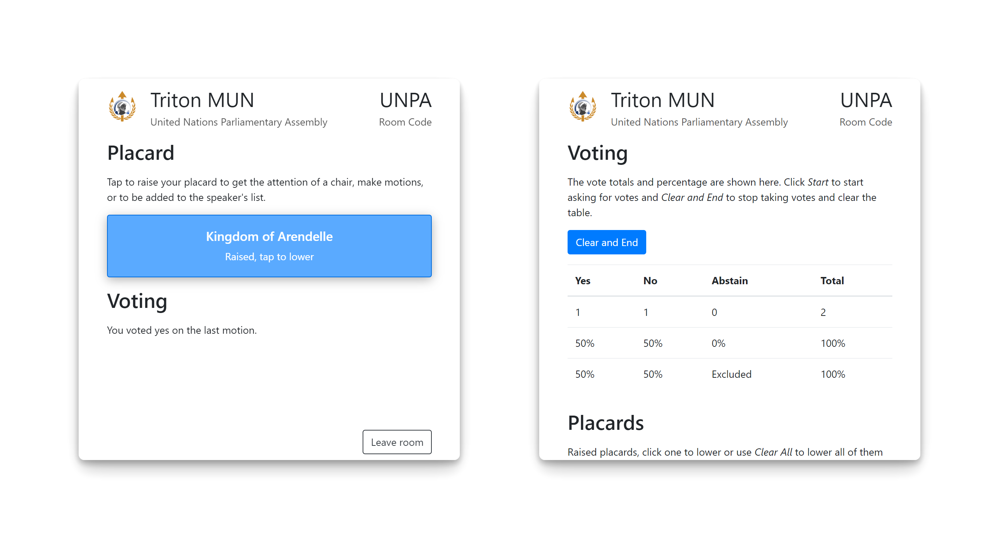

<div align="center">


# Triton Poll

**Live virtual voting and placard rasing for Model United Nations conferences**

[](/LICENSE)

</div>

## Description

Custom web app utilizing WebSockets to send messages between a React.js client and a Node.js server.

## Screenshot



Pictured on the left is the audience view with their placard raised, and the right is the speaker view in the same committee.

## Features

- Audience (delegates) and speaker (chairs) views
- Joining specific rooms by a unique code
- Placard raising and lowering
- Viewing and lowering/clearing placards as the speaker
- 'Yes/No/Abstain style' voting
- Voting calculations for the speaker
- Attendance and voting audit for speaker
- Clean up after leaving rooms

## Installation

You can install Triton Poll by cloning the repository locally and then installing the dependencies.

```bash
git clone https://github.com/evelynhathaway/triton-poll.git
cd triton-poll
npm install
```

## Usage

After changing the branding to match your conference, you can deploy using [forever](https://github.com/foreverjs/forever) on any Node.js server.

It currently runs without a database for persistence and clustering or an authentication system, but it could be relatively easily extended to support these.

```bash
# Start the server in production mode using `forever`
npm run start

# Stop the running server
npm run stop
```

## License

Copyright Evelyn Hathaway, [MIT License](https://github.com/evelynhathaway/triton-poll/blob/master/LICENSE)

[Some code](https://github.com/evelynhathaway/triton-poll/commits?author=miloskovacevic) copyright Milos Kovacevic, [MIT License](https://github.com/miloskovacevic/presentation-poll/blob/3145ae23ce1e0c32bddf827b87a3e1c7396b6d76/package.json#L31) (from [presentation-poll](https://github.com/miloskovacevic/presentation-poll))
